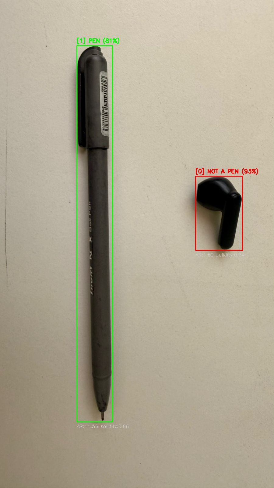
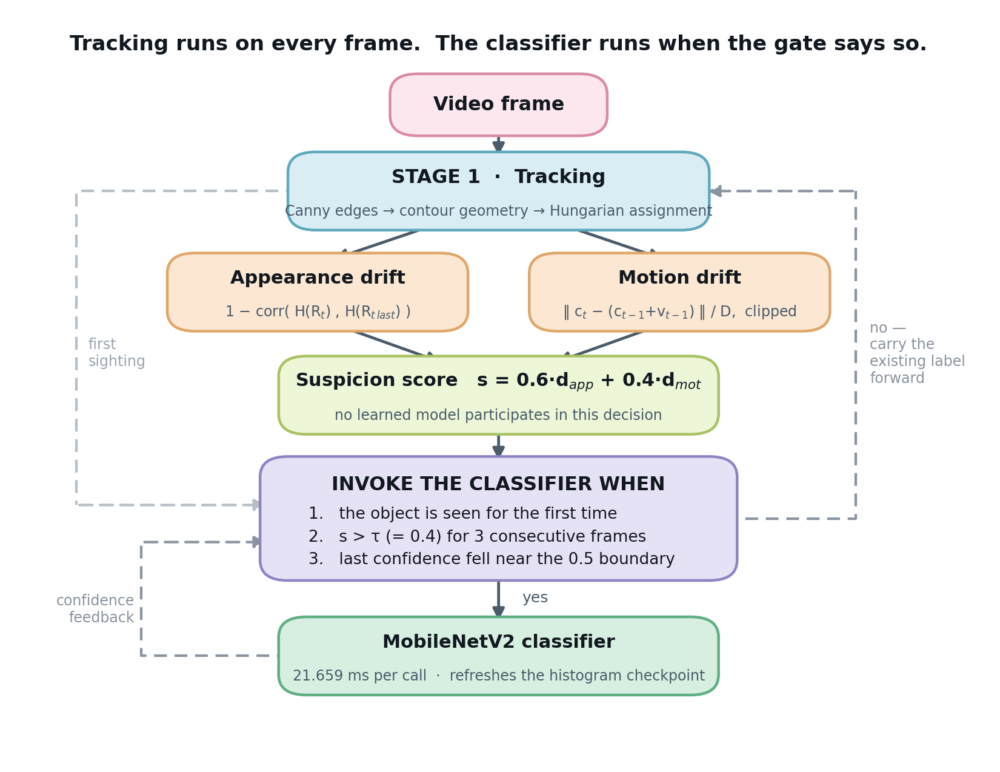
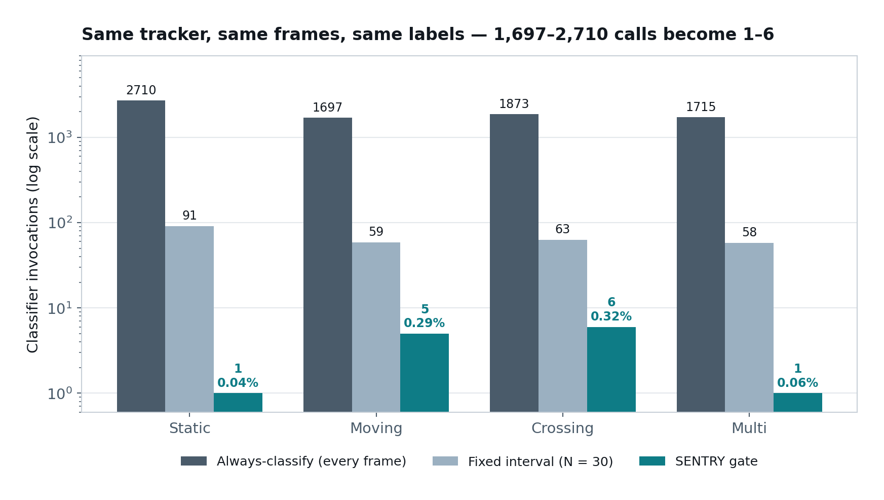
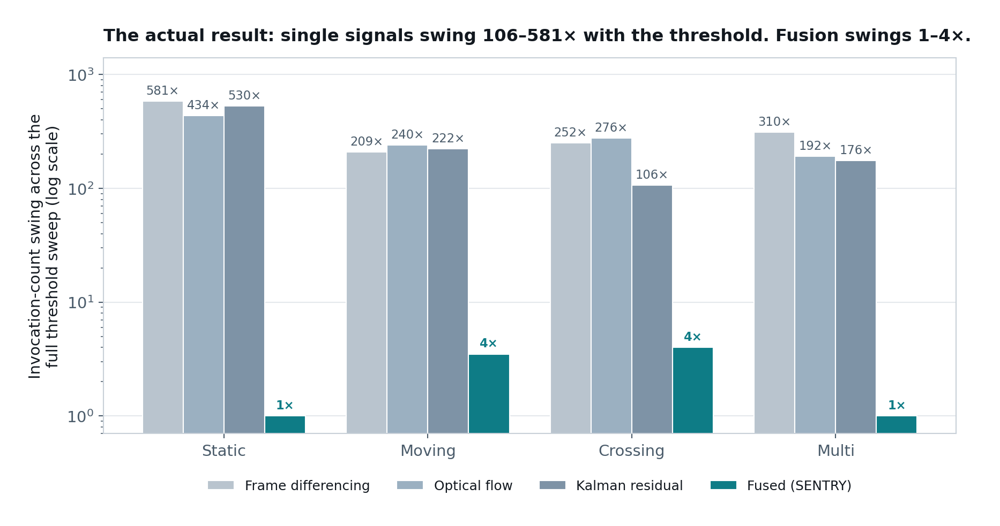

<div align="center">

# SENTRY

### Threshold-Robust, Learning-Free Gating for Edge Vision

**A gating layer that decides *when* a CNN classifier needs to run on a CPU-only edge device — built entirely from classical signals a tracker already produces, with no learned model anywhere in the decision itself.**

[](https://www.python.org/)
[](https://opencv.org/)
[](https://www.tensorflow.org/)
[](https://www.raspberrypi.com/)
[]()

<br>

| Classifier calls removed | Accuracy cost | Threshold swing vs. single signals | Pi 5 throughput |
|:---:|:---:|:---:|:---:|
| **99.1 – 99.96%** | **≤ 0.16 pp** | **1–4×** vs. 106–581× | **32.96 → 112.78 FPS** |

</div>

---

## The one-sentence version

A camera fixed over a conveyor sees nearly the same image thousands of frames in a row. Running a deep classifier on every one of them restates a conclusion the system already holds — so SENTRY watches two cheap classical signals the tracker computes anyway, and wakes the classifier only when they say something actually changed.

<div align="center">

</div>

<div align="center">
<sub><b>Stage 1 output.</b> No learned model has run yet. Contour geometry alone separates these two objects: the pen at aspect ratio <b>11.56</b> / solidity <b>0.86</b>, the earbud at <b>1.69</b> / <b>0.84</b>. The classifier is invoked once per object here — and then, for the rest of the sequence, not at all.</sub>
</div>

---

## Contents

- [Project Overview](#project-overview) · [Problem Statement](#problem-statement) · [Engineering Approach](#engineering-approach)
- [System Architecture](#system-architecture) · [Hardware](#hardware-architecture) · [Software](#software-architecture)
- [Engineering Decisions](#engineering-decisions) · [Validation](#validation) · [**Results**](#results)
- [Lessons Learned](#lessons-learned) · [Future Work](#future-work) · [Repository Organization](#repository-organization) · [Technologies](#technologies-used)

---

## Project Overview

A fixed camera watching a conveyor, a workbench, or a doorway sees almost the same image for thousands of frames in a row. Running a deep classifier on every one of those frames re-confirms a conclusion the system already holds. On a Raspberry Pi–class device with no GPU or NPU, that redundant compute doesn't just waste cycles — it is frequently the difference between a system that hits a usable frame rate and one that doesn't.

The engineering objective of this project was narrow and specific: build a decision layer that tells an existing tracker-plus-classifier pipeline *when* the classifier actually needs to run, without adding a second learned model to make that decision, and without a hidden per-deployment tuning step that only works because someone already knew the answer. Everything in this repository — the training-data preparation, the live-camera debugging, and the final synchronized evaluation — was built in service of that one question.

## Problem Statement

Two jobs are routinely conflated in edge vision systems: **finding and following an object** (must run every frame, must be cheap) and **deciding whether the object's identity or label still holds** (does not need to run every frame, and is the expensive part). Conditional-execution systems that address the second job typically do it by training another model to decide when the first model should run — NoScope, Reducto, and MARLIN all do this. That solves scene-awareness, but it puts a second learned component, and its own inference cost, directly in the thing that was supposed to be saving compute. On hardware where the entire problem is that learned inference is expensive, moving the expense into the trigger doesn't solve anything.

If this gate isn't built, the system either burns its frame-rate budget on redundant classification, or falls back to a fixed schedule that is blind to the scene between ticks — a short interval wastes most of its invocations, a long one holds a stale label indefinitely. Neither is acceptable on hardware that has already committed to running without an accelerator.

### Where SENTRY sits in the literature

| System | Appearance | Motion | Learned gate | Needs accelerator |
|---|:---:|:---:|:---:|:---:|
| NoScope | ✅ | ❌ | ⚠️ Yes | ⚠️ Yes |
| Glimpse | ✅ | ✅ | No | No |
| Reducto | ✅ | ❌ | ⚠️ Yes | No |
| ApproxNet | ✅ | ❌ | No | No |
| REACT/REM | ❌ | ✅ | No | No |
| CTD | ❌ | ✅ | No | No |
| MARLIN | ✅ | ✅ | ⚠️ Yes | No |
| **SENTRY (this work)** | **✅** | **✅** | **None** | **No** |

## Engineering Approach

The starting assumption was that a tracker already computes almost everything a gate needs, for free, as a side effect of tracking: where an object is, roughly what it looks like, and how it's been moving. The question became whether a decision built entirely from those existing signals could compete with a decision built from a purpose-trained model.

Three alternatives were considered before settling on the final design:

- **A fixed-interval timer.** Rejected as a *primary* mechanism (though kept as an evaluation baseline) because its correctness depends entirely on how often the scene actually changes, which the timer cannot see.
- **A single classical signal** (frame differencing, optical-flow magnitude, or a Kalman filter's position residual — each already published separately). Rejected as the sole gating signal because each one is blind to a specific failure mode: frame differencing reacts to illumination flicker with no object movement at all; a pure motion signal misses a stationary object that has changed appearance (rotated, swapped, discolored) without moving.
- **A learned gate** (a small trained classifier deciding whether to invoke the main classifier), the approach taken by MARLIN. Rejected because it reintroduces a training and calibration burden into the one part of the system meant to be cheap and portable across deployments.

The design that was built instead fuses two classical, zero-training signals — appearance drift from a color-histogram correlation, and motion drift from a constant-velocity prediction residual — into one weighted suspicion score. The key empirical assumption underlying this choice, made explicit rather than left implicit, is that the two signals rarely respond to the *same* disturbance at the same time: illumination flicker moves appearance but not motion, and centroid jitter moves motion but not appearance. Fusing them means each term damps the other's noise, and the combined score only crosses threshold when both actually agree something changed.

## System Architecture



The pipeline runs in two stages, on every frame:

**Stage 1 — Tracking (runs every frame, 8.678 ms).** Grayscale conversion, CLAHE local-contrast normalization, Gaussian blur, Canny edge detection, morphological closing/dilation, external contour extraction, then three geometric filters (area, solidity against the convex hull, elongation from a rotated minimum-area rectangle). Confirmed detections are matched to existing tracks by Hungarian assignment on centroid distance; unmatched detections open new tracks, and tracks that briefly go unmatched are held in a bounded "boundary memory" rather than dropped immediately, so momentary occlusion doesn't fragment an object's identity.

**Stage 2 — The gate (runs every frame, decides invocation).** For each tracked object:

$$d^{\,app}_i = 1 - \mathrm{corr}\big(H(R_t),\, H(R_{t_{last}})\big)
\qquad
d^{\,mot}_i = \min\left(\frac{\lVert c_t - (c_{t-1} + v_{t-1})\rVert}{D},\; 1\right)$$

$$s_i = 0.6\,d^{\,app}_i + 0.4\,d^{\,mot}_i$$

The classifier is invoked when the object is seen for the first time, when $s_i > \tau$ (= 0.4) for three consecutive frames, or when the classifier's own last confidence landed close to the 0.5 decision boundary. Everything else — continued tracking with no re-classification — is the default, no-invoke path.

Inputs are raw video frames; outputs are a persistent per-object label, updated only when the gate decides it's warranted. Feedback runs in one direction only: the classifier's confidence can influence the *next* invocation decision, but Stage 1 tracking never depends on Stage 2 output.

On the crossing recording (`data/suspicion_logs/drift_classify/crossing.csv`), the classifier fires **15 times** across ~1,500 object-frames: 11 of those are unavoidable first-sighting bootstraps (a track ID opening), and only **4** are drift-triggered — one of which lands five frames *ahead* of a hand-marked occlusion event. The rest of the time the score sits near zero and the gate simply carries the existing label forward.

## Hardware Architecture

- **Target platform: Raspberry Pi 5 (Model B), CPU-only, no GPU/NPU delegate.** Selected specifically because it represents the hardware class this problem exists on: cheap enough to deploy widely, with no accelerator to fall back on if the invocation rate isn't controlled. Every latency number in this repository was measured directly on this device (`vcgencmd get_throttled` confirmed `0x0` — no thermal throttling contaminating the numbers), not extrapolated from a desktop benchmark.
- **Camera:** a standard USB/built-in webcam via OpenCV's `cv2.VideoCapture`. No depth sensor, IR, or specialized imaging hardware — the entire detection pipeline works from ordinary RGB frames, which was a deliberate constraint: any gating benefit had to come from the algorithm, not from better sensing.
- **Limitations accepted:** no accelerator means every millisecond spent in Stage 1 or Stage 2 is on the critical path with no possibility of hiding it behind a hardware queue. This is precisely why the invocation *rate*, not just invocation *cost*, is the quantity this project optimizes.

## Software Architecture

The codebase is organized into three stages of the same underlying idea, kept in three separate top-level folders because each answers a different engineering question:

- **[`cropping-algos/`](cropping-algos/)** — offline data preparation. Eight iterations of segmenting a pen from an arbitrary background, without a trained model, to build the classifier's training set. See that folder's own README for the per-script breakdown; the short version is that this folder is where a background-removal choice was made that later measurably capped classifier accuracy (see [Lessons Learned](#lessons-learned)).
- **[`live-footage-test-code/`](live-footage-test-code/)** — Stage 1 development against a live webcam. Six iterations, ending in `FINALTRACKING.py`, which is architecturally the direct ancestor of Stage 1 in the reported pipeline: Hungarian centroid matching, closed-boundary solidity/border checks, and per-object threaded classification. This is also where a model-output labeling bug was found and fixed by directly inspecting debug output rather than guessing.
- **[`program-files-and-results/`](program-files-and-results/)** — the reproducible artifact. Three invocation strategies (always-classify, fixed-interval, drift-triggered) sharing one Stage 1 tracker, run under a single synchronized harness so that only the invocation *decision* differs between them, plus every data file and log backing the paper's numbers.

Control flow is single-process and frame-synchronous in every pipeline: each video frame is read, passed through Stage 1, then (conditionally) Stage 2, with no asynchronous frame buffering between stages. Threading is used narrowly — one thread per in-flight classifier call in the live-feed code, later consolidated to a single persistent worker thread behind a queue in the offline pipelines, after a TensorFlow/Keras threading fragility issue caused ad hoc `threading.Thread` spawns to occasionally stall mid-run. There is no ROS layer; this is a standalone Python/OpenCV pipeline by design, matching the CPU-only, no-middleware deployment target.

## Engineering Decisions

<details>
<summary><b>Why Canny edge detection over background subtraction or color thresholding, for Stage 1?</b></summary>

<br>

Background subtraction assumes a static background, which does not hold for a conveyor-style deployment where the background itself may shift. Color thresholding needs sustained object-background contrast, which is exactly what fails under variable lighting. Canny edge detection followed by contour geometry needs no background model at all, at a measured cost of 8.678 ms/frame on the target hardware — a fixed, known cost rather than a variable one.

</details>

<details>
<summary><b>Why Hungarian assignment over greedy nearest-neighbor for track matching?</b></summary>

<br>

Greedy assignment can misassign identity when two tracked objects are close together, since it commits to each match locally instead of finding the assignment that's globally cheapest. The Hungarian algorithm solves the full bipartite matching problem in one step, at negligible added cost for the small number of simultaneously tracked objects this system targets.

</details>

<details>
<summary><b>Why a rotated minimum-area rectangle over an axis-aligned bounding box for elongation?</b></summary>

<br>

An axis-aligned box under-reports elongation for an object near a 45° angle to the frame, which can fail an aspect-ratio filter outright — this was found empirically, not anticipated: an early axis-aligned version silently suppressed a second object in the multi-object recording (1.00 objects/frame uncorrected vs. 1.90 corrected) until the bug was traced and fixed.

</details>

<details>
<summary><b>Why a weighted sum of two signals rather than one?</b></summary>

<br>

The component ablation shows *why* directly — see the figure below. Appearance-only fires at a 12%+ invocation rate (too expensive to be worth gating) while catching 2 of 3 marked disturbance events; motion-only stays cheap but catches none. The fused score holds near the motion-only invocation cost while recovering one of the two missed detections — the fusion is a deliberate trade, not a default.

</details>

<details>
<summary><b>Why weights of 0.6 (appearance) / 0.4 (motion), and a threshold of 0.4?</b></summary>

<br>

Both were chosen from a sweep against the same recordings they're evaluated on (an explicit limitation — see [Future Work](#future-work)), picking the lowest appearance weight that responds to any marked disturbance, and the threshold just past the point where invocation cost drops steeply without losing the one detection the gate is capable of making. At τ=0.2 the gate fires 238 times (15.93%) and catches 2 of 3 events; at τ=0.4 it fires 15 times (1.00%) and catches 1; above τ=0.45 it catches none.

</details>

<details>
<summary><b>Why MobileNetV2, off the shelf and frozen?</b></summary>

<br>

The classifier is explicitly not a contribution of this work — the gating decision is. A pretrained, frozen backbone with a single sigmoid head keeps the evaluation focused on invocation behavior rather than classifier design, and matches the deployment reality of a small edge model doing one binary task.

</details>

<details>
<summary><b>Why float32 TFLite instead of int8 quantization?</b></summary>

<br>

An earlier int8 conversion had a calibration mismatch between the quantization's implied `pixel/255` scaling and the `-1..1` scaling MobileNet's `preprocess_input` actually applies, causing systematic misclassification that wasn't obvious from the model architecture alone. Reconverting to plain float32 — no quantization, nothing to miscalibrate — resolved it. Every reported Pi latency number therefore reflects an *unoptimized* model; a correctly calibrated int8 conversion would likely be faster still, and is listed as future work.

</details>

### Component ablation

| Scenario | Variant | Invocations | Rate | Events detected |
|---|---|---:|---:|:---:|
| Crossing | Appearance-only | 193 | 12.92% | 2 / 3 |
| Crossing | Motion-only | 12 | 0.80% | 0 / 3 |
| Crossing | **Fused** | **15** | **1.00%** | **1 / 3** |
| Multi | Appearance-only | 168 | 12.55% | — |
| Multi | Motion-only | 5 | 0.37% | — |
| Multi | **Fused** | **7** | **0.52%** | **—** |

Appearance alone costs ~13× more invocations; motion alone catches nothing. The fused score sits near the motion-only cost while recovering one detection — the trade the fusion exists to make.

## Validation

Validation was done entirely on pre-recorded video, not a live feed, so that every invocation strategy could be scored against identical frames of the identical tracked object — a live camera draw would confound the comparison, since no two strategies would ever see the same input.

| Scenario | What it contains |
|---|---|
| **Static** | one untouched object, camera fixed |
| **Moving** | continuous translation, simulating a conveyor |
| **Crossing** | the object disappears and reappears 3×, each occlusion hand-marked |
| **Multi** | two to three objects, repositioned individually |

Classifier quality was validated separately, on eight held-out clips (four pen, four non-pen), with crops extracted by the same Stage 1 code used live. Three invocation strategies were run under one synchronized harness — one tracker pass per recording, each strategy scored independently on identical frames — against the always-classify oracle. The comparison that actually discriminates gating strategies is not against a timer (a sufficiently long fixed interval matches or beats the gate on these recordings, simply because the correct label never changes in any of them) but against three other published, learning-free gating signals, swept across each one's full threshold range on identical tracker output.

## Results

### 1. Gating costs essentially nothing in accuracy



| Scenario | Always | Fixed (N=30) | **SENTRY** | Rate | Agreement with oracle |
|---|---:|---:|---:|---:|---:|
| Static | 2710 | 91 | **1** | 0.04% | 100.00% |
| Moving | 1697 | 59 | **5** | 0.29% | 100.00% |
| Crossing | 1873 | 63 | **6** | 0.32% | 99.84% |
| Multi | 1715 | 58 | **1** | 0.06% | 100.00% |

Across all four scenarios the gate invoked the classifier on 0.04–0.87% of object-frames while staying within **0.16 percentage points** of the always-classify oracle's accuracy.

### 2. Invocation count alone is a weak headline — so here's the comparison that isn't

At its cheapest setting achieving equal detection of marked occlusion events, the fused gate matched the best single-signal gate (frame differencing) *exactly*, used half the invocations of optical-flow gating at a fifth of its false alarms — and did **not** outperform frame differencing at a hand-picked threshold. No such claim is made.

| Gate | Threshold | Invocations | Rate | False alarms |
|---|---:|---:|---:|---:|
| Frame differencing | 50.0 | 4 | 0.214% | 1 |
| Optical flow | 1.0 | 8 | 0.427% | 5 |
| Kalman residual | 20.0 | 5 | 0.267% | 1 |
| **Fused (ours)** | **0.45** | **4** | **0.214%** | **1** |

### 3. The actual contribution: threshold robustness



This is the result the project stands on. Across a full threshold sweep, the three single-signal gates varied in invocation count by **106× to 581×** depending on where the threshold was set, while the fused gate varied by only **1× to 4×**. Frame differencing only matched the fused gate's favorable behavior at a threshold that could not have been chosen in advance without already knowing the answer — its invocation count ranged from 4 at one setting to 503 at another on the same recording.

That is the practical significance: a system tuned once and left running needs a gate whose behavior doesn't swing by two orders of magnitude if the threshold is off by a little. Single classical signals demonstrably do not provide that. The fused gate does.

### 4. On the actual hardware

Stage 1 costs **8.678 ms/frame**, Stage 2 **21.659 ms/call**, both measured on a Raspberry Pi 5 with no accelerator and no thermal throttling. Composed as `FPS = 1000 / (t₁ + r·t₂)`, the gate reaches **97.9% of the theoretical speedup ceiling** (3.42× of a possible 3.50×), rising to a measured **5.90×** on the two-object recording and — by the same formula, untested and listed as future work — a projected ~20.7× at eight simultaneous objects. The benefit grows with scene population, not recording length.

### 5. The failure mode, stated plainly

The same low invocation count that makes the gate cheap is also its sharpest exposed risk: on one recording, the gate invoked once, happened to be correct, and reported 100% accuracy — while the classifier behind it was in fact only **28.80%** reliable on that footage. **A gate that fires rarely is only as trustworthy as the few classifications it commits to.** This is the direct motivation for the bounded re-invocation safeguard in [Future Work](#future-work), and it is why that safeguard is described there as *necessary* rather than optional.

## Lessons Learned

### A data-prep decision made in one folder set a ceiling discovered in another

| Training condition | Accuracy | Precision | F1 | False positives |
|---|---:|---:|---:|---:|
| Background-removed crops | 59.78% | 0.686 | 0.695 | **225** (21.0%) |
| Background retained | **77.46%** | **0.933** | **0.803** | **35** (3.3%) |

Producing clean, background-removed training crops looked like the obviously-correct data prep step. It wasn't: a classifier trained on those crops learned silhouette as close to its only signal. On a non-pen clip containing a drawing compass — whose silhouette closely resembles a pen — the background-removed model misclassified **100%** of crops as pen, while a background-*retained* model correctly rejected **84.4%**. Accuracy rises from 59.78% to 77.46% and precision from 0.686 to 0.933, with the entire change concentrated in the false-positive cell.

The engineering lesson is specific: a preprocessing decision made for data-cleanliness reasons can quietly become a modeling decision, and its effect may not surface until a much later evaluation stage.

### Debugging a labeling bug required looking at raw model output, not the display logic

Three consecutive live-feed iterations (`testingalgo-2` through `testingalgo-4`) all reproduced the same constant-label symptom while the engineer iterated on detection quality, UI layout, and threshold values — none of which was the actual cause. The fix only appeared once raw predicted indices and confidences were printed directly to the terminal, revealing a mismatch between the assumed label order and the model's actual sigmoid convention. The lesson generalizes: when a symptom persists across changes to code that isn't the suspect, stop changing that code and go inspect the actual values at the suspected boundary instead.

### Ad hoc threading around a `model.predict()` call is not free, even when it looks safe

The live-feed scripts spawned a fresh `threading.Thread` for every classification attempt; this occasionally caused inference to stall entirely after one or two calls, traced to TensorFlow/Keras threading fragility rather than application logic. It was replaced with a single persistent worker thread consuming a queue, guaranteeing `model.predict()` is always called from the same thread context. This change alone made the difference between a pipeline that could run a full multi-minute recording and one that silently froze partway through.

### A metric that looks decisive can be an artifact of the evaluation, not the system

Invocation count alone initially looked like a clean win for the gate. It doesn't discriminate a real advantage on these particular recordings, because the correct label never changes in any of them — a long-enough fixed interval matches the gate's staleness by construction. The comparison that actually mattered (against other scene-aware signals, not a timer) had to be built deliberately; the first, easier comparison would have overstated the result.

## Future Work

- **Measure response latency directly**, by recording a session where the tracked object's class changes while its identity is maintained (e.g. substituting the object under occlusion). Every current recording has a constant correct label throughout, so how quickly a gate notices and corrects a genuine change is currently untested, not just unmeasured.
- **Tune the fusion weight and threshold on a held-out split**, rather than the same recordings they are evaluated on. The current settings (0.6/0.4 weighting, 0.4 threshold) are defensible choices, not proven optimal ones, since the sweep and the evaluation currently share data.
- **Replace the raw centroid velocity estimate with a Kalman filter** in the motion term, to reduce jitter and potentially recover the marked occlusion events the current motion signal misses.
- **Implement the bounded re-invocation safeguard** directly (a maximum interval since last invocation, not just a confidence-boundary trigger), so a wrong label from an unreliable classifier cannot persist indefinitely just because the scene stays visually quiet — the failure mode identified in [Results](#5-the-failure-mode-stated-plainly).
- **Broaden the training and evaluation set** beyond a single dark, thin, low-texture pen, to test whether the appearance term's robustness transfers to textured or multi-colored objects, and retrain with negatives spanning more elongated object categories to address the false-positive risk identified in classifier validation.
- **Attempt a correctly calibrated int8 TFLite conversion** now that the quantization/preprocessing mismatch is understood, to establish a real (not just projected) lower latency bound on the Pi 5.
- **Run an end-to-end wall-clock benchmark** rather than the current two-stage latency composition, and confirm the multi-object speedup projection at higher, currently-untested object counts.

## Repository Organization

```
cropping-algos/              offline training-data preparation (8 scripts,
                              classical CV + one learned-segmentation detour)
live-footage-test-code/      Stage-1 tracking development against a live
                              webcam (6 iterations, ending in FINALTRACKING.py)
program-files-and-results/   the reproducible pipeline: three invocation
                              strategies, shared tracker, full data/results
  ├── src/                    pipelines, benchmarking, model conversion, utils
  ├── data/                   ground truth, suspicion logs, summaries
  ├── results/figures/        every chart in this README
  └── archive/                superseded scripts, kept for provenance only
models-used/                 the four trained .h5 models (cropped/uncropped)
```

Each folder has its own README with a per-file breakdown; this document is the project-level view.

## Technologies Used

| Layer | Stack |
|---|---|
| **Language** | Python 3 |
| **Computer Vision** | OpenCV — Canny, CLAHE, contour extraction, morphology, color-histogram correlation, `cv2.VideoCapture` |
| **Tracking / Assignment** | SciPy `linear_sum_assignment` (Hungarian), constant-velocity prediction implemented directly |
| **Machine Learning** | TensorFlow / Keras (MobileNetV2, frozen, ImageNet-pretrained), TFLite float32 for edge deployment |
| **Data prep only** | `rembg` / U²-Net (`u2netp`) — **not** part of the runtime pipeline |
| **Embedded target** | Raspberry Pi 5 Model B, Debian 13, CPU only, `tflite-runtime` / `ai-edge-litert` |
| **Supporting** | NumPy, Pillow, `concurrent.futures.ThreadPoolExecutor`, `threading` + `queue` |

## Paper & References

This repository is the code and data behind **"SENTRY: Threshold-Robust Learning-Free Gating for Edge Vision"** (Tharun Premkumar and Dharshan Raju R D, Chennai Institute of Technology). The full 34-source reference list — spanning conditional-execution video analytics (NoScope, Glimpse, Reducto, ApproxNet, REACT/REM, CTD, MARLIN, ODIN), classical computer vision (Canny, Hungarian method, convex hulls, CLAHE, border-following, color indexing, Farnebäck flow, Kalman filtering), and the object-detection and mobile-vision literature (YOLO, Faster R-CNN, YOLOv4, MobileNet/MobileNetV2, ImageNet) — is in the paper, which is the authoritative source for citations.

---

<div align="center">
<sub>All figures in this README are generated from the data files in <code>program-files-and-results/data/</code>.</sub>
</div>
